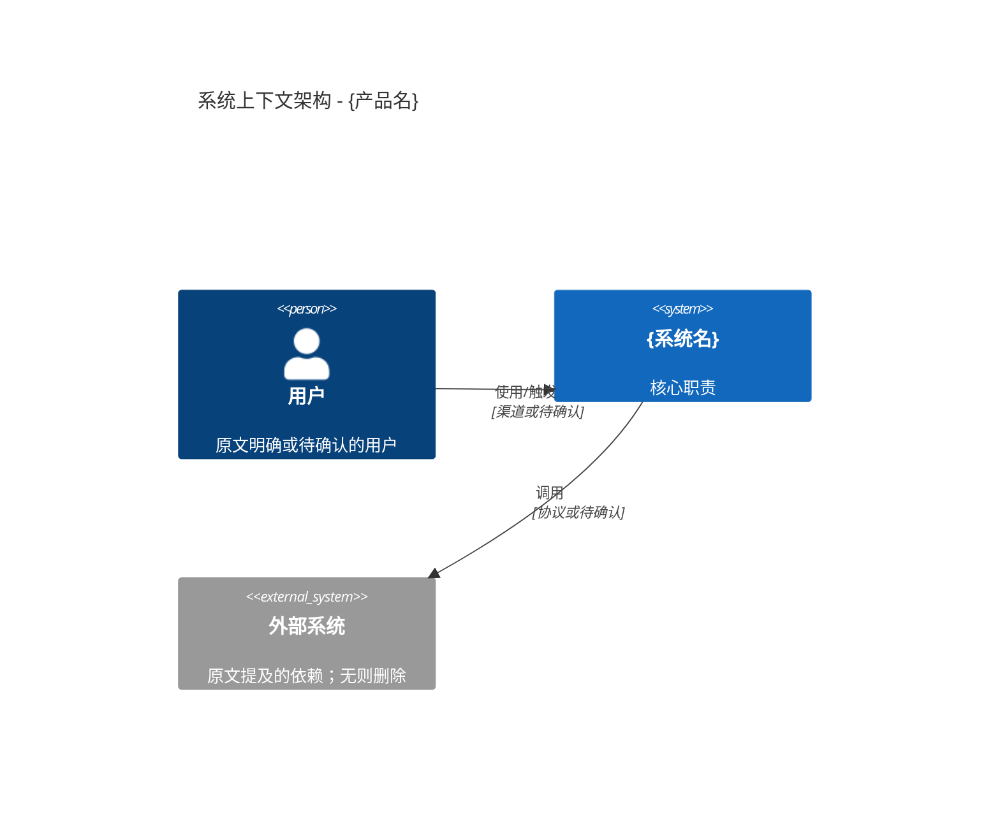
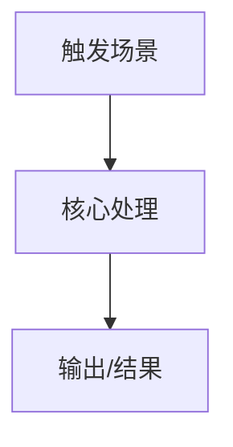

# Docs2PRD - PRD 结构与模板

## 文档头模板
```markdown
# 产品需求规格说明书（PRD）

**文档名称：** {产品名称或主题}
**版本：** V1.0
**日期：** {YYYY-MM-DD}
**原文来源：** {原文标题或文件名}{（平台/作者，如有）}
**原文链接：** {URL 或 本地文件路径}
**信息溯源说明：** 核心内容来自上述原文；补充内容统一标注【原文未明确提及，按通用产品/软件工程规范补充】。

---
```

## 推荐 8 大章结构
```markdown
## 1. 文档概述
### 1.1 目的与适用范围
### 1.2 原文来源与溯源方式
### 1.3 术语定义与缩写表
### 1.4 参考文档

## 2. 业务背景与产品定位
### 2.1 背景/痛点
### 2.2 产品目标
### 2.3 目标用户与核心场景
### 2.4 范围与约束

## 3. 需求规范
### 3.1 整体需求概述
### 3.2 功能性需求（FR）
### 3.3 非功能性需求（NFR）
### 3.4 数据需求
### 3.5 接口需求
### 3.6 其他约束

## 4. 总体方案与架构
### 4.1 核心方案
### 4.2 系统上下文图
### 4.3 容器/模块架构
### 4.4 核心流程与数据流

## 5. 模块框架与详细设计
### 5.1 模块拆分
### 5.2 模块说明
### 5.3 模块交互

## 6. 验收标准与测试要求
### 6.1 功能验收标准
### 6.2 非功能验收标准
### 6.3 测试范围与方法

## 7. 风险评估与规避方案

## 8. 附录
### 8.1 原文核心信息抽取对照表
### 8.2 待确认问题
### 8.3 图表源码
```

## 需求表模板
```markdown
| ID | 需求描述 | 优先级 | 来源 | 验收标准 | 待确认 |
|---|---|---|---|---|---|
| FR-001 | 系统应... | P0/P1/P2 | 【原文...】 | 给定...当...则... | 无/问题 |
```

## NFR 表模板
```markdown
| ID | 类型 | 指标/要求 | 来源 | 验收方式 | 状态 |
|---|---|---|---|---|---|
| NFR-001 | 性能 | 原文未量化，建议待确认 | 【原文未明确提及，按通用产品/软件工程规范补充】 | 压测/监控 | 待确认 |
```

## C4 / Mermaid 模板
优先使用原文架构描述。若原文无架构，图表标题或说明必须标注“建议架构草案”。

````markdown

````

````markdown

````

## 文件命名建议
若用户未指定路径，可使用：

```text
{产品名或主题}-{文档类型}-{YYYYMMDD}.prd.md
```

规则：
- 产品名来自原文；没有明确产品名时用主题名。
- 删除媒体化修饰词：干货、揭秘、震撼、怒锤、终极、感叹号。
- 不把作者名、平台名、完整标题直接塞进文件名。
- 如果用户要求 `.prd` 后缀，按用户要求。

## 可选归档
只有用户明确要求维护 wiki/知识库时，才执行归档：
1. 归档原文。
2. 写入 PRD。
3. 更新 index/log。
