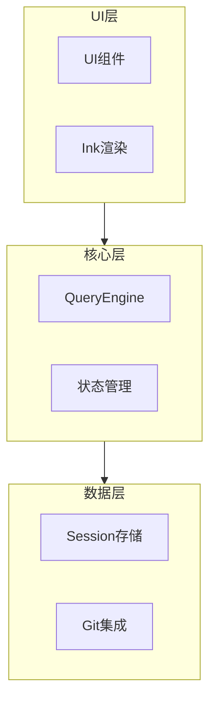
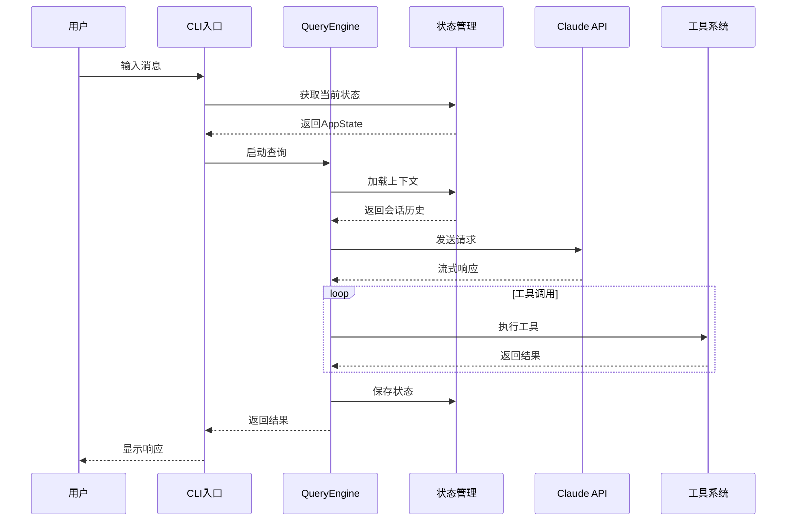
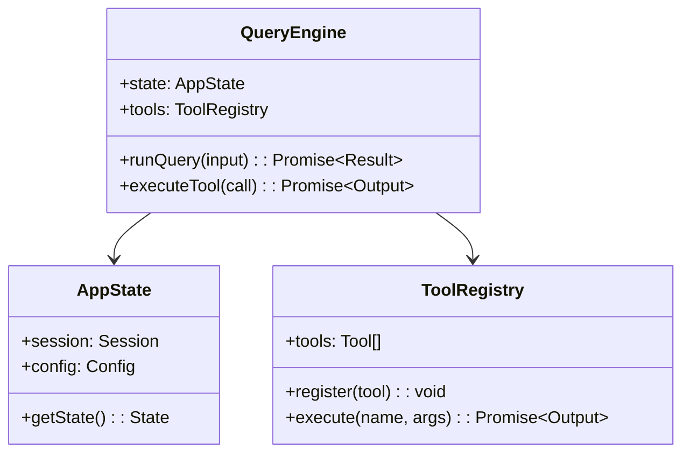
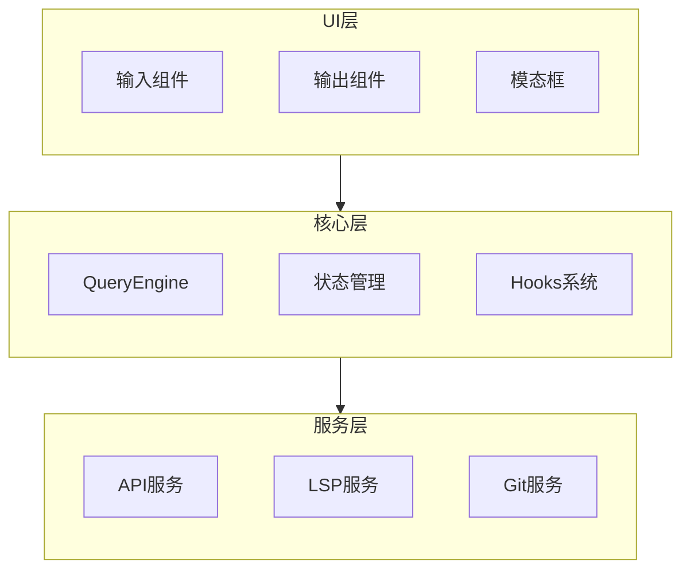
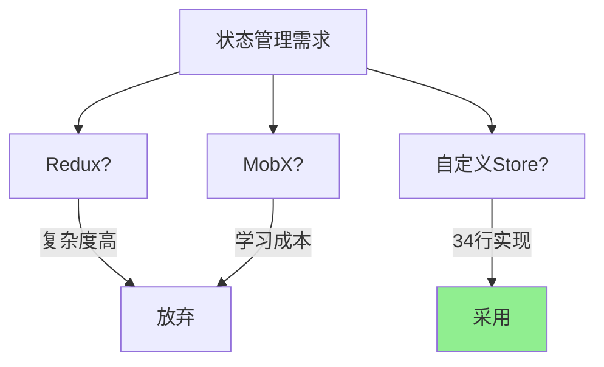
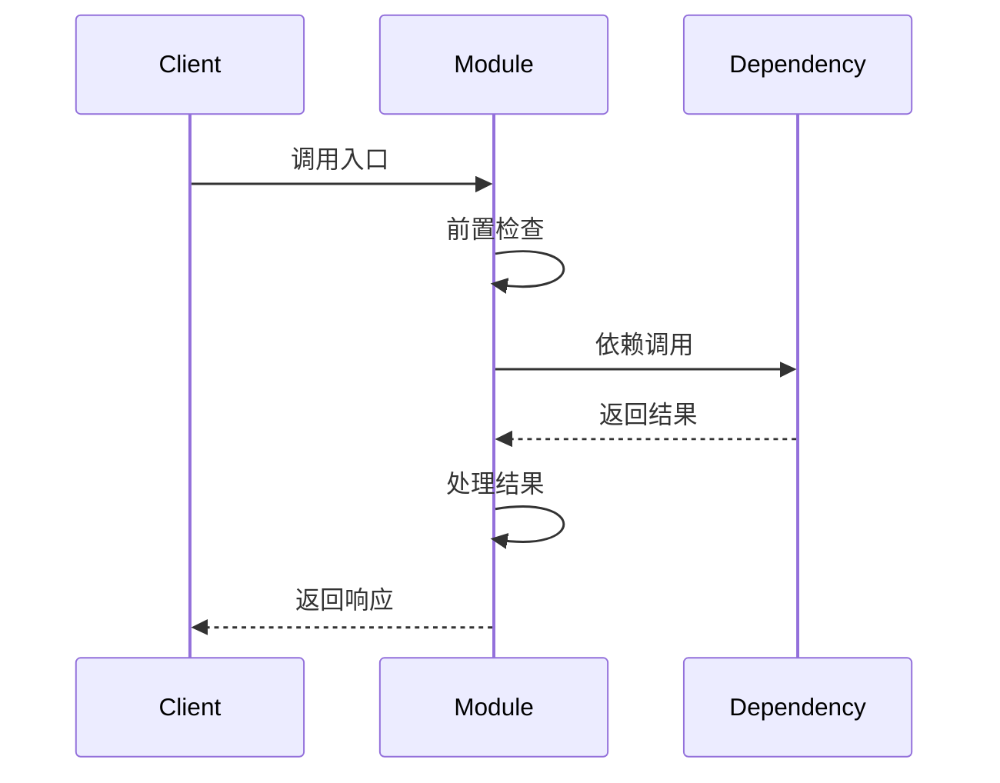
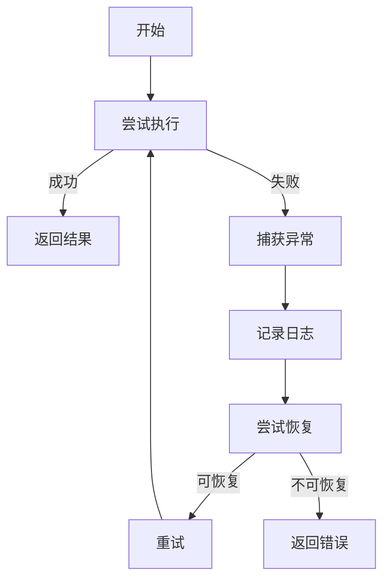

# Refactor2Docs - 优化版技能 (v2.0)

**版本**: v2.0  
**更新日期**: 2026-04-13  
**优化方向**: 融合 GitNexus 图谱分析能力  

---

## 主要优化点

基于与 GitNexus Wiki 的对比分析，v2.0 版本进行了以下增强：

1. **新增第8层: 代码图谱** - 集成关系可视化和执行流追踪
2. **增强架构文档** - 增加 Mermaid 图表和时序图
3. **增加影响分析** - 在重构指南中集成变更影响检查
4. **双语支持** - 支持中文/英文/双语输出
5. **机器可读元数据** - 生成 JSON 格式的模块关系数据
6. **Web导航界面** - 生成 index.html 交互式文档浏览器

---

## 优化后的八层文档架构

```
01-需求文档/          # 产品需求文档 (PRD) - 无变化
02-架构设计/          # 系统架构设计 - 增强Mermaid图表
03-模块设计/          # 详细模块设计 - 增加执行流章节
04-测试用例/          # 测试规范 - 无变化
05-构建部署/          # 构建和部署 - 无变化
06-重构指南/          # 重构指南 - 增加影响分析章节
07-技能文档/          # 方法论记录 - 无变化
08-代码图谱/          # [新增] 关系图谱和执行流可视化
```

---

## 第8层: 代码图谱 (新增)

### 8.1 目录结构

```
08-代码图谱/
├── README.md                    # 图谱总览
├── index.html                   # [新增] Web交互界面
├── meta.json                    # [新增] 机器可读元数据
├── 模块依赖图.md                # Mermaid依赖关系图
├── 执行流程图.md                # 核心流程时序图
├── 数据流图谱.md                # 数据流动可视化
├── 符号关系索引.md              # 关键类/函数关系表
└── [模块]/                      # 各模块详细图谱
    ├── [模块]-依赖关系.md
    ├── [模块]-执行流程.md
    └── [模块]-符号索引.md
```

### 8.2 文档内容规范

#### 模块依赖图.md

```markdown
# 模块依赖关系图

## 整体架构



## 模块依赖矩阵

| 模块 | 依赖模块 | 被依赖模块 | 风险等级 |
|------|----------|------------|----------|
| 状态管理 | - | QueryEngine, ToolSystem | 高 |
| QueryEngine | 状态管理, 工具系统 | UI组件 | 高 |
| 工具系统 | 状态管理 | QueryEngine | 中 |

## 关键依赖说明

### 高风险依赖 (循环依赖/深度依赖)

1. **状态管理 → QueryEngine → 工具系统 → 状态管理**
   - 风险: 循环依赖
   - 建议: 通过接口解耦

### 跨模块调用统计

| 调用方向 | 调用次数 | 主要调用点 |
|----------|----------|------------|
| UI → Core | 45 | 组件渲染, 事件处理 |
| Core → Data | 32 | 状态持久化, 数据查询 |
```

#### 执行流程图.md

```markdown
# 核心执行流程图

## 流程1: 对话回合执行



### 流程步骤说明

| 步骤 | 组件 | 操作 | 关键代码 |
|------|------|------|----------|
| 1 | CLI | 接收用户输入 | `main.tsx:handleInput()` |
| 2 | State | 加载当前状态 | `state/index.ts:loadState()` |
| 3 | Engine | 组装上下文 | `QueryEngine.ts:assembleContext()` |
| 4 | API | 流式请求 | `api/client.ts:streamRequest()` |
| 5 | Tools | 执行工具链 | `tools/executor.ts:execute()` |
| 6 | State | 持久化状态 | `state/persist.ts:save()` |

### 性能关键点

- **状态加载**: 平均 5ms (目标 < 10ms)
- **API响应**: 首token平均 500ms
- **工具执行**: 取决于具体工具 (Bash: 10-5000ms)
```

#### 符号关系索引.md

```markdown
# 关键符号关系索引

## 核心类/接口关系

### QueryEngine



### 函数调用关系

| 函数 | 调用者 | 被调用函数 | 调用次数 |
|------|--------|------------|----------|
| `runQuery()` | CLI入口 | `assembleContext()`, `streamRequest()` | 1/会话 |
| `executeTool()` | QueryEngine | 各Tool的`call()` | N/回合 |
| `loadState()` | Bootstrap | `readFile()`, `parseJSON()` | 1/启动 |

### 跨文件引用

| 符号 | 定义位置 | 引用位置 | 引用次数 |
|------|----------|----------|----------|
| `AppState` | `state/index.ts` | 23个文件 | 156次 |
| `Tool` | `Tool.ts` | 45个文件 | 289次 |
| `AgentId` | `types/ids.ts` | 12个文件 | 67次 |
```

### 8.3 机器可读元数据 (meta.json)

```json
{
  "version": "2.0",
  "generatedAt": "2026-04-13T10:00:00Z",
  "project": {
    "name": "Claude Code",
    "language": "TypeScript",
    "files": 1902,
    "linesOfCode": 512347
  },
  "modules": [
    {
      "id": "state-management",
      "name": "状态管理",
      "category": "core",
      "files": ["src/state/index.ts", "src/state/store.ts"],
      "symbols": {
        "exported": ["AppState", "createStore", "useAppState"],
        "internal": ["reducer", "selector"]
      },
      "dependencies": ["react", "zod"],
      "dependents": [
        { "module": "query-engine", "strength": "strong" },
        { "module": "tool-system", "strength": "medium" }
      ],
      "metrics": {
        "complexity": 8.5,
        "testCoverage": 0.95,
        "linesOfCode": 2341
      }
    }
  ],
  "relationships": {
    "total": 46769,
    "byType": {
      "imports": 12345,
      "calls": 23456,
      "extends": 123,
      "implements": 456
    }
  },
  "executionFlows": [
    {
      "id": "conversational-turn",
      "name": "对话回合执行",
      "steps": 6,
      "entryPoint": "main.tsx:handleInput",
      "exitPoint": "components/Output.tsx:render",
      "modulesInvolved": ["cli", "state", "query", "tools", "ui"]
    }
  ]
}
```

---

## 架构设计文档增强

### 2.1 新增 Mermaid 图表章节

在原有架构文档基础上，增加以下章节：

```markdown
## 2.5 架构可视化

### 2.5.1 组件关系图



### 2.5.2 数据流图


### 2.5.3 模块依赖图

[引用 08-代码图谱/模块依赖图.md]
```

### 2.2 关键设计决策可视化

```markdown
## 3. 关键设计决策

### 3.1 状态管理方案对比



**决策**: 采用自定义Store模式
- **原因**: 仅需34行实现Redux核心功能
- **收益**: 减少依赖，完全可控
- **风险**: 需自行维护，团队需理解原理
```

---

## 模块设计文档增强

### 3.1 新增执行流章节

在详细设计文档中增加：

```markdown
## 6. 执行流程

### 6.1 主流程



### 6.2 流程步骤详解

| 步骤 | 函数 | 输入 | 输出 | 说明 |
|------|------|------|------|------|
| 1 | `entry()` | Request | - | 入口验证 |
| 2 | `validate()` | Request | boolean | 参数校验 |
| 3 | `process()` | ValidRequest | Result | 核心处理 |
| 4 | `format()` | Result | Response | 格式化输出 |

### 6.3 异常处理流程


```

### 3.2 接口依赖表格

```markdown
## 7. 接口依赖

### 7.1 上游依赖 (本模块依赖谁)

| 依赖模块 | 依赖符号 | 用途 | 是否可选 |
|----------|----------|------|----------|
| types | AppState | 状态类型 | 否 |
| utils | logger | 日志记录 | 是 |
| config | getConfig | 配置读取 | 否 |

### 7.2 下游依赖 (谁依赖本模块)

| 依赖模块 | 依赖符号 | 用途 | 影响等级 |
|----------|----------|------|----------|
| QueryEngine | useStore | 状态访问 | 高 |
| ToolSystem | dispatch | 状态更新 | 高 |
| components | useAppState | 组件状态 | 中 |

### 7.3 依赖风险分析

- **高风险**: 被10+模块依赖的接口变更需评估影响
- **中风险**: 核心执行流中的依赖变更需回归测试
- **低风险**: 工具类依赖可独立升级
```

---

## 重构指南增强

### 6.1 新增影响分析章节

```markdown
## 7. 变更影响分析

### 7.1 变更前检查清单

在修改任何代码前，必须完成以下检查：

#### 步骤1: 识别变更范围
- [ ] 明确修改的模块/类/函数
- [ ] 确定变更类型 (重构/优化/修复)
- [ ] 评估变更复杂度

#### 步骤2: 分析上游依赖
```bash
# 查找谁调用了这个函数
grep -r "functionName(" src --include="*.ts" | grep -v "node_modules"
```

- [ ] 列出所有调用者
- [ ] 评估对调用者的影响
- [ ] 确定是否需要同步修改

#### 步骤3: 分析下游依赖
- [ ] 列出本模块依赖的模块
- [ ] 评估依赖变更的影响
- [ ] 检查版本兼容性

#### 步骤4: 评估测试覆盖
- [ ] 查看当前测试覆盖率
- [ ] 确定需要补充的测试
- [ ] 规划回归测试范围

### 7.2 风险等级评估

| 风险等级 | 条件 | 处理策略 |
|----------|------|----------|
| **CRITICAL** | 影响>10个模块或核心执行流 | 必须评审，完整回归测试 |
| **HIGH** | 影响5-10个模块 | 建议评审，重点测试 |
| **MEDIUM** | 影响2-5个模块 | 通知相关开发者，常规测试 |
| **LOW** | 影响<2个模块 | 常规CR流程 |

### 7.3 常见高风险变更

#### 高风险场景

1. **状态管理接口变更**
   - 影响范围: 所有使用useAppState的组件
   - 风险等级: CRITICAL
   - 应对: 保持向后兼容，渐进式迁移

2. **工具系统API变更**
   - 影响范围: 所有工具实现
   - 风险等级: HIGH
   - 应对: 提供适配层，文档化变更

3. **权限模型变更**
   - 影响范围: 所有工具调用点
   - 风险等级: CRITICAL
   - 应对: 安全评审，全量测试

### 7.4 变更影响报告模板

```markdown
## 变更影响报告

**变更描述**: [简要描述]
**变更范围**: [模块/类/函数]
**风险等级**: [CRITICAL/HIGH/MEDIUM/LOW]

### 影响分析

| 维度 | 影响描述 | 应对措施 |
|------|----------|----------|
| 上游依赖 | [哪些模块受影响] | [如何处理] |
| 下游依赖 | [依赖哪些模块变更] | [如何处理] |
| 测试覆盖 | [需要补充的测试] | [测试计划] |
| 文档更新 | [需更新的文档] | [更新计划] |

### 验证清单

- [ ] 所有调用点已更新
- [ ] 单元测试通过
- [ ] 集成测试通过
- [ ] 文档已更新
- [ ] 变更日志已记录
```
```

---

## 双语支持规范

### 7.1 文档语言选项

技能支持三种语言模式：
- `zh`: 中文（默认）
- `en`: 英文
- `bilingual`: 双语对照

### 7.2 双语文档格式

```markdown
# [Module] Architecture Design / [模块]架构设计

## Overview / 概述

### Responsibility / 职责

**English**: The module is responsible for...

**中文**: 本模块负责...

### Core Concepts / 核心概念

| English Term | 中文术语 | Description |
|--------------|----------|-------------|
| Query Engine | 查询引擎 | ... |
| Tool System | 工具系统 | ... |
```

### 7.3 术语对照表

在文档附录中统一提供：

```markdown
## Appendix: Terminology / 附录: 术语表

| English | 中文 | Definition |
|---------|------|------------|
| Agent | 智能体 | ... |
| Tool | 工具 | ... |
| Context | 上下文 | ... |
| Session | 会话 | ... |
```

---

## Web导航界面 (index.html)

### 8.1 功能特性

生成的Web界面包含：

1. **侧边栏导航**
   - 7层文档结构树
   - 快速搜索
   - 模块过滤

2. **内容展示**
   - Markdown渲染
   - Mermaid图表支持
   - 代码高亮

3. **交互功能**
   - 文档间跳转
   - 关系图谱可视化
   - 符号搜索

4. **图谱可视化**
   - 模块依赖图
   - 执行流程图
   - 符号关系图

### 8.2 界面结构

```html
<!DOCTYPE html>
<html>
<head>
  <title>Claude Code Documentation</title>
  <script src="mermaid.min.js"></script>
  <script src="marked.min.js"></script>
  <style>
    /* 文档主题样式 */
  </style>
</head>
<body>
  <div id="sidebar">
    <input type="search" placeholder="搜索...">
    <nav id="tree">
      <!-- 文档树 -->
    </nav>
  </div>
  <main id="content">
    <!-- Markdown内容 -->
  </main>
  <div id="graph-panel">
    <!-- 关系图谱 -->
  </div>
</body>
</html>
```

---

## 使用方式

### 基础使用 (同v1.0)

```bash
# 分析代码并生成文档
claude /refactor2docs analyze ./src --output ./docs
```

### 新增选项

```bash
# 指定语言
claude /refactor2docs analyze ./src --output ./docs --language bilingual

# 生成Web界面
claude /refactor2docs analyze ./src --output ./docs --web

# 集成GitNexus数据
claude /refactor2docs analyze ./src --output ./docs --gitnexus ./.gitnexus

# 完整模式 (所有增强功能)
claude /refactor2docs analyze ./src --output ./docs --full
```

---

## 迁移指南 (从v1.0到v2.0)

### 兼容性

- v2.0完全兼容v1.0的文档结构
- 新增的08-代码图谱目录是独立的
- 现有文档无需修改

### 升级步骤

1. **更新技能文件**
   ```bash
   cp OPTIMIZED_SKILL.md /path/to/skills/refactor2docs/SKILL.md
   ```

2. **重新生成文档**
   ```bash
   claude /refactor2docs analyze ./src --output ./docs-v2 --full
   ```

3. **合并现有文档** (可选)
   ```bash
   # 将v1.0文档复制到v2.0目录
   cp -r docs-v1/01-需求文档 docs-v2/
   cp -r docs-v1/02-架构设计 docs-v2/
   # ... 其他目录
   ```

4. **生成增强内容**
   ```bash
   # 仅生成第8层和增强内容
   claude /refactor2docs enhance ./docs-v2 --gitnexus ./.gitnexus
   ```

---

## 总结

Refactor2Docs v2.0 在保留v1.0核心优势的基础上：

1. **融合图谱能力** - 新增第8层代码图谱
2. **增强可视化** - Mermaid图表和Web界面
3. **支持影响分析** - 重构前风险评估
4. **双语支持** - 满足国际化团队需求
5. **机器可读** - JSON元数据支持程序化使用

这样既保留了Refactor2Docs在重构指导方面的优势，又吸收了GitNexus在关系可视化和代码分析方面的能力，形成更完整的文档解决方案。

---

**版本**: v2.0  
**最后更新**: 2026-04-13  
**作者**: Claude Code Agent
