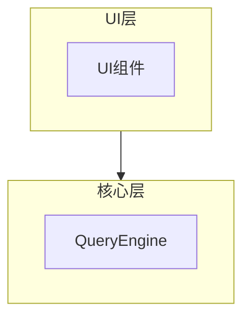
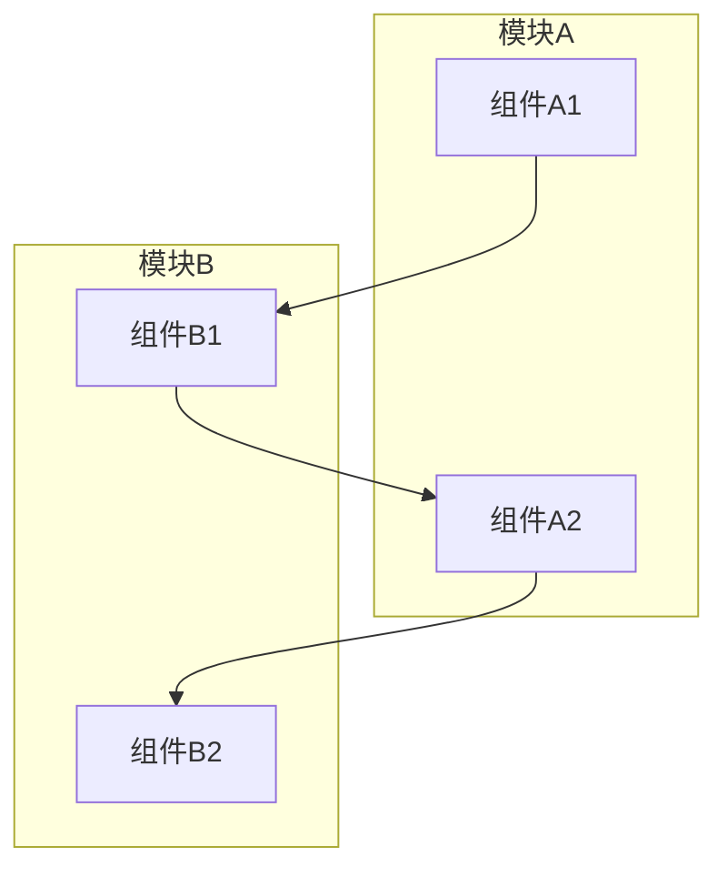
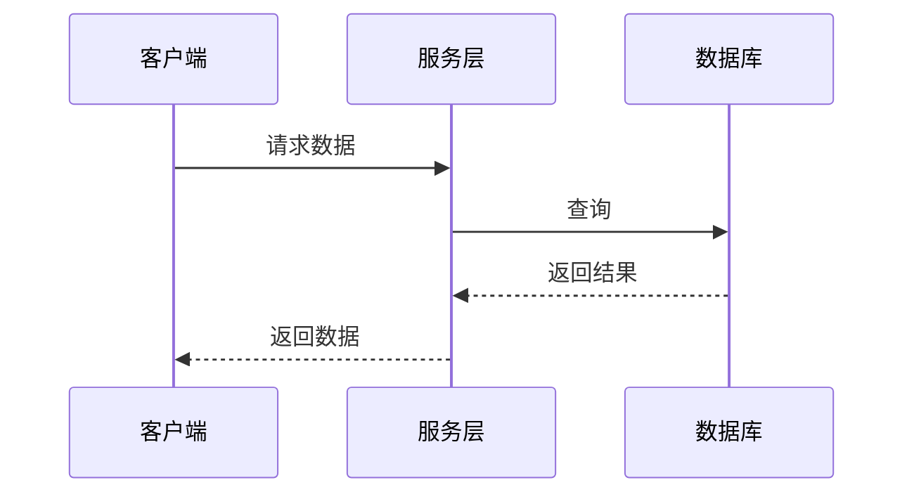
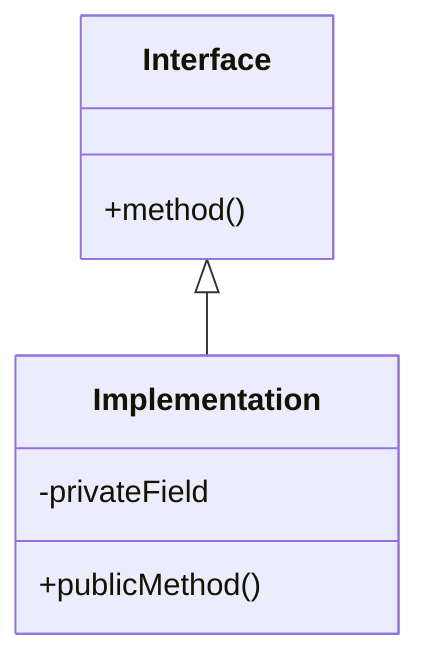

# Refactor2Docs - 代码转文档重构技能

**版本**: v2.0  
**作者**:DeepLoad  
**更新日期**: 2026-04-13  
**适用范围**: 大型代码库分析转文档，支撑完整项目重构

---

## 1. 技能概述

### 1.1 为什么需要这个技能

**问题**: 为什么源项目一开始没法转化成最终要求的文档？

**核心痛点**:
1. **代码规模大** - 1900+文件，51万+行代码，无从下手
2. **架构复杂** - 35+模块，多层架构，依赖关系复杂
3. **文档缺失** - 原始项目文档不完整，需要反向工程
4. **知识分散** - 关键逻辑分散在多个文件中
5. **重构困难** - 没有完整文档支撑，重构风险高

**解决方案**: 系统化的代码分析转文档方法论

### 1.2 技能目标

将大型代码库（1000+文件）转化为结构化、可重构的文档集，实现：
- ✅ 完整的架构理解
- ✅ 详细的模块设计
- ✅ 清晰的依赖关系
- ✅ 可执行的测试用例
- ✅ 可落地的重构指南
- ✅ 可视化的代码图谱
- ✅ 变更影响分析能力

---

## 2. 核心方法论

### 2.1 八层文档架构

```
01-需求文档/          # 产品需求文档 (PRD)
  ├── 产品需求总览.md  # 整体产品需求
  └── [模块]-PRD.md    # 各模块需求

02-架构设计/          # 系统架构设计
  ├── 系统架构总览.md  # 整体架构
  └── [模块]架构设计.md # 各模块架构

03-模块设计/          # 详细模块设计
  └── [模块]-详细设计.md # 各模块详细设计

04-测试用例/          # 测试规范
  ├── 单元测试用例.md
  ├── 集成测试用例.md
  └── E2E测试用例.md

05-构建部署/          # 构建和部署
  ├── 构建指南.md
  └── 部署指南.md

06-重构指南/          # 重构指南
  ├── 重构指南.md
  ├── 代码模板.md
  ├── 实施清单.md
  └── 07-变更影响分析/  # 变更影响分析
      ├── 变更检查清单.md
      ├── 风险评估指南.md
      └── 影响报告模板.md

07-技能文档/          # 方法论记录
  └── 代码分析转文档方法论.md

08-代码图谱/          # 关系图谱和执行流可视化
  ├── README.md
  ├── index.html                   # Web交互界面
  ├── meta.json                    # 机器可读元数据
  ├── 模块依赖图.md                # Mermaid依赖关系图
  ├── 执行流程图.md                # 核心流程时序图
  ├── 数据流图谱.md                # 数据流动可视化
  ├── 符号关系索引.md              # 关键类/函数关系表
  └── [模块]/                      # 各模块详细图谱
      ├── [模块]-依赖关系.md
      ├── [模块]-执行流程.md
      └── [模块]-符号索引.md
```

### 2.2 四阶段分析流程

#### Phase 1: 探索阶段 (Exploration)

**目标**: 全面理解代码库结构和关键模块

**步骤**:
1. **整体结构探索**
   ```bash
   # 统计文件数量和代码行数
   find src -name "*.ts" -o -name "*.tsx" | wc -l
   find src -name "*.ts" -o -name "*.tsx" | xargs wc -l | tail -1
   
   # 查看目录结构
   ls -la src/
   tree -L 2 src/
   ```

2. **模块识别**
   - 识别核心模块（state, tools, components等）
   - 识别功能模块（buddy, bridge, voice等）
   - 识别服务模块（api, mcp, oauth等）

3. **关键文件定位**
   - 入口文件（main.tsx, cli.tsx）
   - 核心类/接口（Tool.ts, QueryEngine.ts）
   - 配置文件（package.json, tsconfig.json）

**输出**: 模块清单、文件清单、依赖关系图

#### Phase 2: 分析阶段 (Analysis)

**目标**: 深入理解每个模块的实现逻辑

**步骤**:
1. **架构分析**
   - 分层架构识别
   - 数据流分析
   - 依赖关系梳理

2. **模块分析**
   - 核心类/接口分析
   - 关键算法分析
   - 设计模式识别

3. **安全分析**
   - 权限机制
   - 数据流安全
   - 潜在风险点

4. **关系图谱分析**
   - 模块间依赖关系
   - 执行流程追踪
   - 符号级关系映射

**输出**: 架构图、类图、流程图、风险清单、关系图谱

#### Phase 3: 文档生成阶段 (Documentation)

**目标**: 生成完整的文档集

**文档生成顺序**:
1. **PRD文档** - 从代码提取功能需求
2. **架构设计** - 从整体到局部
3. **详细设计** - 深入到代码级别
4. **测试用例** - 覆盖核心功能
5. **重构指南** - 可落地的实施指南
6. **代码图谱** - 关系可视化和执行流

**生成原则**:
- 中文优先（支持双语）
- 代码示例完整
- 架构图清晰（Mermaid图表）
- 可追溯性（代码↔文档）

#### Phase 4: 验证阶段 (Verification)

**目标**: 确保文档完整性和可重构性

**检查清单**:
- [ ] 所有模块都有PRD
- [ ] 所有核心模块都有架构设计
- [ ] 所有关键功能都有详细设计
- [ ] 测试用例覆盖核心功能
- [ ] 重构指南可落地执行
- [ ] 代码图谱完整
- [ ] Mermaid图表可渲染
- [ ] meta.json格式正确

---

## 3. 关键技术点

### 3.1 代码探索技术

**并行探索策略**:
```typescript
// 同时启动多个探索代理
task(subagent_type="explore", prompt="分析状态管理系统...")
task(subagent_type="explore", prompt="分析工具系统...")
task(subagent_type="explore", prompt="分析智能体编排...")
task(subagent_type="explore", prompt="分析构建系统...")
```

**关键文件识别**:
```bash
# 查找入口文件
find src -name "index.ts" -o -name "main.ts" -o -name "*.tsx" | head -20

# 查找核心类/接口
grep -r "export.*interface\|export.*class" src --include="*.ts" | head -30

# 分析导入关系
grep -r "import.*from" src/[module] --include="*.ts" | grep -v "node_modules"
```

### 3.2 文档生成技术

**模板化生成**:
- 使用统一的文档模板
- 保持结构一致性
- 确保可追溯性

**代码示例提取**:
- 从源码提取关键代码片段
- 简化后作为示例
- 确保可运行性

**Mermaid图表生成**:
```markdown

```

### 3.3 质量保证技术

**完整性检查**:
```bash
# 统计文档数量
find output -name "*.md" | wc -l

# 检查文档大小
du -sh output/*

# 验证文档结构
ls -la output/01-需求文档/
ls -la output/02-架构设计/
ls -la output/03-模块设计/

# 验证meta.json
node -e "JSON.parse(require('fs').readFileSync('output/08-代码图谱/meta.json'))"

# 验证Mermaid语法
npx mmdc -i output/08-代码图谱/模块依赖图.md -o test.svg
```

**一致性检查**:
- 模块名称一致性
- 接口定义一致性
- 术语使用一致性

---

## 4. 实战案例

### 4.1 Claude Code项目文档化

**项目规模**:
- 1,902 源文件
- 513,237 行 TypeScript 代码
- 35+ 功能模块

**文档产出**:
- 39+ 个文档文件（v1.0）
- 08-代码图谱层（7+文件）
- 900 KB 总大小
- 8 层文档结构

**关键成果**:
1. 识别了35个功能模块
2. 补充了KAIROS、ULTRAPLAN等隐藏功能
3. 详细设计了Session、Memory、Context压缩等核心机制
4. 提供了完整的重构指南和代码模板
5.生成了模块依赖图和执行流程图
6. 提供了变更影响分析能力

### 4.2 文档使用案例

**场景1: 架构理解**
```
阅读顺序:
1. 产品需求总览.md - 了解产品背景
2. 系统架构总览.md - 理解整体架构
3. [模块]架构设计.md - 深入具体模块
4. 08-代码图谱/模块依赖图.md - 可视化依赖关系
```

**场景2: 功能开发**
```
阅读顺序:
1. [模块]-PRD.md - 了解需求
2. [模块]-详细设计.md - 查看设计
3. 代码模板.md - 获取模板
4. 测试用例.md - 编写测试
5. 08-代码图谱/[模块]-执行流程.md - 理解调用链
```

**场景3: 项目重构**
```
阅读顺序:
1. 重构指南.md - 了解策略
2. 06-重构指南/07-变更影响分析/变更检查清单.md - 评估影响
3. 实施清单.md - 按计划执行
4. 代码模板.md - 使用模板
5. 设计模式.md - 遵循模式
```

**场景4: 代码维护
```
阅读顺序:
1. 08-代码图谱/README.md - 图谱总览
2. 08-代码图谱/index.html - 交互式浏览
3. 08-代码图谱/符号关系索引.md - 查找符号关系
4. 08-代码图谱/执行流程图.md - 追踪执行流
```

---

## 5. 工具使用

### 5.1 代码分析工具

**文件统计**:
```bash
# 统计文件数量
find src -type f \( -name "*.ts" -o -name "*.tsx" \) | wc -l

# 统计代码行数
find src -type f \( -name "*.ts" -o -name "*.tsx" \) | xargs wc -l | tail -1

# 按目录统计
find src -type d | while read dir; do
  echo "$dir: $(find $dir -type f | wc -l) files"
done
```

**依赖分析**:
```bash
# 分析导入关系
grep -r "import.*from" src --include="*.ts" | \
  sed 's/.*from "\(.*\)".*/\1/' | \
  sort | uniq -c | sort -rn | head -20
```

### 5.2 文档生成工具

**Markdown模板**:
```markdown
# [模块名] [文档类型]

**版本**: v1.0  
**最后更新**: YYYY-MM-DD

---

## 1. 概述

### 1.1 职责

### 1.2 核心概念

---

## 2. 架构设计

---

## 3. 详细设计

---

## 4. 代码示例

---

## 5. 相关文档

---

**文档结束**
```

**Mermaid图表工具**:
```bash
# 安装Mermaid CLI
npm install -g @mermaid-js/mermaid-cli

# 验证图表语法
mmdc -i input.md -o output.svg

# 批量生成
for file in output/08-代码图谱/*.md; do
  mmdc -i "$file" -o "${file%.md}.svg"
done
```

**Web界面生成**:
```bash
# 生成交互式HTML
node scripts/generate-web.js --input output --output output/index.html

# 本地预览
npx serve output
```

### 5.3 图谱生成工具

**关系数据提取** (可选，需GitNexus):
```bash
# 导出GitNexus关系数据
npx gitnexus export --format json --output relations.json

# 转换为文档格式
node scripts/convert-relations.js relations.json
```

**meta.json生成**:
```bash
# 生成机器可读元数据
node scripts/generate-meta.js --source src --output output/08-代码图谱/meta.json
```

---

## 6. 最佳实践

### 6.1 探索阶段

1. **先整体后局部** - 先了解整体架构，再深入模块
2. **并行探索** - 同时探索多个模块提高效率
3. **记录关键发现** - 及时记录重要的架构决策

### 6.2 文档生成阶段

1. **模板化** - 使用统一的文档模板
2. **中文优先** - 默认使用中文，支持双语
3. **代码示例** - 提供可运行的代码示例
4. **图表辅助** - 使用 Mermaid 图表辅助说明
5. **关系可视化** - 生成依赖图和执行流图

### 6.3 验证阶段

1. **交叉验证** - 不同文档间相互验证
2. **抽样检查** - 随机抽查文档质量
3. **完整性统计** - 统计文档覆盖度
4. **图表渲染** - 验证Mermaid图表可正确渲染

### 6.4 图谱生成最佳实践

1. **保持简洁** - 每个图表聚焦一个主题
2. **层次分明** - 使用子图组织复杂关系
3. **颜色编码** - 用颜色区分模块类型
4. **版本控制** - 图表随代码一起更新
5. **可访问性** - 提供图表的文字描述

### 6.5 影响分析最佳实践

1. **先分析后修改** - 永远先评估影响再动手
2. **风险分级** - 按影响范围分级处理
3. **渐进式重构** - 大变更拆分为小步骤
4. **保持兼容** - 尽量保持向后兼容
5. **完整测试** - 高风险变更必须回归测试

---

## 7. 常见问题

### Q1: 如何处理大型代码库？

**A**: 采用分层探索策略：
1. 第一层：识别主要模块
2. 第二层：分析模块间关系
3. 第三层：深入关键模块
4. 使用并行代理提高效率
5. 使用代码图谱可视化依赖

### Q2: 如何保证文档质量？

**A**: 多维度质量保证：
1. 完整性检查清单
2. 跨文档一致性检查
3. 可重构性验证
4. 代码示例可运行性验证
5. Mermaid图表语法验证

### Q3: 如何处理缺失的文档？

**A**: 根据代码反推：
1. 从代码中提取功能点
2. 从接口推断架构
3. 从测试推断需求
4. 从执行流推断业务逻辑

### Q4: 如何保持文档更新？

**A**: 建立更新机制：
1. 代码变更触发文档更新
2. 定期文档审查
3. 版本控制文档
4. 使用meta.json追踪符号变化

### Q5: 如何使用代码图谱？

**A**: 代码图谱使用场景：
1. **架构理解** - 查看模块依赖图理解整体结构
2. **Bug追踪** - 通过执行流程图定位问题
3. **变更评估** - 使用影响分析评估修改风险
4. **新人入职** - 通过可视化快速理解代码库

---

## 8. 总结

### 8.1 核心价值

1. **知识沉淀** - 将代码知识转化为文档
2. **降低门槛** - 新成员快速理解系统
3. **支撑重构** - 提供重构的完整依据
4. **便于维护** - 文档指导后续维护
5. **可视化关系** - 图谱展示代码关系
6. **影响分析** - 评估变更风险

### 8.2 成功要素

1. **系统化方法** - 遵循四阶段流程
2. **工具支持** - 使用自动化工具提高效率
3. **质量保证** - 多维度确保文档质量
4. **持续迭代** - 文档随代码持续更新
5. **图谱驱动** - 可视化辅助理解
6. **双语支持** - 满足国际化需求

### 8.3 新增能力

| 能力 | 说明 | 价值 |
|------|------|------|
| **第8层代码图谱** | 关系可视化和执行流追踪 | 直观理解代码关系 |
| **Mermaid图表** | 架构图、时序图、数据流图 | 可视化文档 |
| **变更影响分析** | 评估修改风险 | 安全重构 |
| **双语支持** | 中文/英文/双语对照 | 国际化团队 |
| **机器可读元数据** | JSON格式符号关系 | 程序化使用 |
| **Web导航界面** | 交互式HTML浏览 | 易用性提升 |

---

## 9. 附录

### 9.1 文档模板库

**PRD模板**:
```markdown
# [模块名] 需求规格说明书

## 1. 功能概述
## 2. 用户故事
## 3. 功能需求
## 4. 非功能需求
## 5. 接口需求
## 6. 验收标准
```

**架构设计模板**:
```markdown
# [模块名] 架构设计

## 1. 架构概述
## 2. 组件图
## 3. 数据流
## 4. 接口定义
## 5. 关键设计决策
## 6. 依赖关系
## 7. 架构可视化
### 7.1 Mermaid组件图
### 7.2 Mermaid数据流图
### 7.3 Mermaid模块依赖图
```

**详细设计模板**:
```markdown
# [模块名] 详细设计

## 1. 模块概述
## 2. 类/接口设计
## 3. 数据模型
## 4. 算法说明
## 5. 接口定义
## 6. 代码示例
## 7. 执行流程
### 7.1 主流程时序图
### 7.2 流程步骤详解
### 7.3 异常处理流程
## 8. 接口依赖
### 8.1 上游依赖
### 8.2 下游依赖
### 8.3 依赖风险分析
```

### 9.2 检查清单

**完整性检查**:
- [ ] 所有模块都有PRD
- [ ] 所有核心模块都有架构设计
- [ ] 所有关键功能都有详细设计
- [ ] 测试用例覆盖核心功能
- [ ] 重构指南可落地
- [ ] 代码图谱完整
- [ ] 变更影响分析文档

**质量检查**:
- [ ] 文档结构一致
- [ ] 术语使用一致
- [ ] 代码示例正确
- [ ] 图表清晰
- [ ] 可追溯性良好
- [ ] Mermaid语法正确
- [ ] meta.json格式正确

### 9.3 图谱模板库

**模块依赖图模板**:
```markdown

```

**执行时序图模板**:
```markdown

```

**类关系图模板**:
```markdown

```

**变更影响分析模板** :
```markdown
# 变更影响分析报告

## 变更描述
[简要描述变更内容]

## 变更范围
- **模块**: [模块名]
- **文件**: [文件路径]
- **符号**: [函数/类/接口名]
- **类型**: [重构/优化/修复/新增]

## 影响分析

### 上游依赖 (谁调用我)
| 调用者 | 调用位置 | 调用次数 | 影响 |
|--------|----------|----------|------|
| | | | |

### 下游依赖 (我调用谁)
| 被调用者 | 调用位置 | 调用次数 | 影响 |
|----------|----------|----------|------|
| | | | |

### 跨模块影响
| 模块 | 影响点 | 风险等级 |
|------|--------|----------|
| | | |

## 风险等级
[ ] CRITICAL  [ ] HIGH  [ ] MEDIUM  [ ] LOW

## 测试策略
- [ ] 单元测试
- [ ] 集成测试
- [ ] E2E测试
- [ ] 回归测试

## 验证清单
- [ ] 所有调用点已更新
- [ ] 测试用例已补充
- [ ] 文档已更新
- [ ] 变更日志已记录
```

---

## 10. 配置选项
### 10.1 命令行选项

```bash
# 基础用法
claude /refactor2docs analyze <source-dir> --output <output-dir>

# 语言选项
--language zh|en|bilingual    # 默认: zh

# 图谱选项
--graphs                      # 生成图谱 (默认开启)
--no-graphs                   # 跳过图谱生成
--gitnexus <path>             # 集成GitNexus数据

# Web界面
--web                         # 生成Web界面
--no-web                      # 跳过Web界面 (默认)

# 完整模式
--full                        # 启用所有增强功能
```

### 10.2 配置文件

`.refactor2docs.json`:
```json
{
  "language": "bilingual",
  "graphs": {
    "enabled": true,
    "types": ["dependency", "flow", "data"],
    "format": "mermaid"
  },
  "web": {
    "enabled": true,
    "theme": "default",
    "features": ["search", "graph-view"]
  },
  "gitnexus": {
    "enabled": true,
    "path": "./.gitnexus"
  }
}
```

### 10.3 环境变量

```bash
REFACTOR2DOCS_LANGUAGE=bilingual
REFACTOR2DOCS_GRAPHS=true
REFACTOR2DOCS_WEB=true
REFACTOR2DOCS_GITNEXUS_PATH=./.gitnexus
```

---
