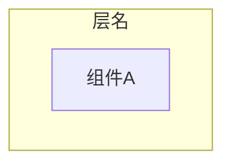
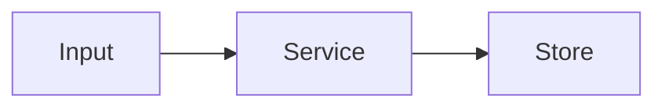
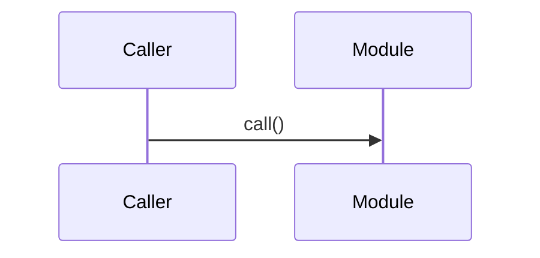

# Refactor2Docs - 模板

## 通用文档头
```markdown
# [标题]

> 来源范围：[目录/文件列表]
> 证据等级：源码确认 / 基于代码推测 / 待确认
> 更新时间：YYYY-MM-DD

## 摘要
- [1-3 条核心结论，每条带来源]

## 证据索引
| 结论 | 来源 |
|---|---|
| ... | `path:line` |
```

## PRD 模板
```markdown
# [模块名] 需求规格说明书

## 1. 功能概述
## 2. 用户/调用方
## 3. 用户故事或调用场景
## 4. 功能需求
| 编号 | 需求 | 来源 | 确定性 |
|---|---|---|---|
## 5. 非功能需求
## 6. 接口需求
## 7. 验收标准
## 8. 待确认问题
```

## 架构设计模板
````markdown
# [模块名] 架构设计

## 1. 架构概述
## 2. 分层与组件

## 3. 数据流

## 4. 接口定义
| 接口/函数 | 入参 | 出参 | 副作用 | 来源 |
|---|---|---|---|---|
## 5. 关键设计决策
## 6. 依赖关系
## 7. 风险与约束
````

## 详细设计模板
````markdown
# [模块名] 详细设计

## 1. 模块概述
## 2. 类/接口/函数设计
| 符号 | 类型 | 职责 | 来源 |
|---|---|---|---|
## 3. 数据模型
## 4. 核心算法/规则
## 5. 状态与副作用
## 6. 异常处理
## 7. 执行流程

## 8. 上游/下游依赖
## 9. 重构注意事项
````

## 测试规范模板
```markdown
# [模块名] 测试规范与用例

## 1. 测试范围与策略
## 2. 旧行为锁定测试
## 3. 单元测试用例
| 对象 | 场景 | 输入/前置状态 | 期望 | 来源 |
|---|---|---|---|---|
## 4. 集成测试用例
## 5. E2E 测试场景
## 6. 边界与异常用例
## 7. 覆盖率/质量门禁
## 8. 暂无法自动化的人工验证
```

## 变更影响分析模板
```markdown
# 变更影响分析报告

## 1. 变更描述
## 2. 变更范围
| 模块 | 文件 | 符号 | 类型 | 来源 |
|---|---|---|---|---|
## 3. 影响分析
### 3.1 上游依赖（谁调用我）
| 调用方 | 位置 | 调用方式 | 影响 |
|---|---|---|---|
### 3.2 下游依赖（我调用谁）
| 被调用方 | 位置 | 调用方式 | 影响 |
|---|---|---|---|
### 3.3 跨模块/配置/数据影响
## 4. 风险等级
- CRITICAL / HIGH / MEDIUM / LOW
## 5. 测试策略
## 6. 回滚方案
## 7. 验证清单
```

## 代码图谱 meta.json 模板
```json
{
  "project": "",
  "generatedAt": "YYYY-MM-DD",
  "modules": [
    {
      "name": "",
      "path": "",
      "role": "",
      "entrypoints": [],
      "upstream": [],
      "downstream": [],
      "keySymbols": []
    }
  ],
  "edges": [
    { "from": "", "to": "", "type": "import|call|data|config", "evidence": "path:line" }
  ]
}
```
